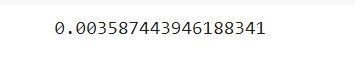

# Implementation-of-SVM-For-Spam-Mail-Detection

## AIM:
To write a program to implement the SVM For Spam Mail Detection.

## Equipments Required:
1. Hardware – PCs
2. Anaconda – Python 3.7 Installation / Moodle-Code Runner

## Algorithm
1. Import the necessary packages.
2. Read the given csv file and display the few contents of the data.
3. Assign the features for x and y respectively.
4. Split the x and y sets into train and test sets.
5. Convert the Alphabetical data to numeric using CountVectorizer.
6. Predict the number of spam in the data using SVC (C-Support Vector Classification) method of SVM (Support vector machine) in sklearn library.
7. Find the accuracy of the model.

## Program:
```PY
/*
Program to implement the SVM For Spam Mail Detection..
Developed by: NaveenKumar.S
RegisterNumber:  212221240033

import numpy as np
import matplotlib.pyplot as plt
import pandas as pd
dataset=pd.read_csv("/content/spam.csv",encoding='latin-1')
dataset
dataset.head()
dataset.info()
dataset.isnull().sum()
X = dataset["v1"].values
Y = dataset["v2"].values
from sklearn.model_selection import train_test_split
X_train, X_test, Y_train, Y_test = train_test_split(X,Y,test_size=0.2,random_state=0)
from sklearn.feature_extraction.text import CountVectorizer
cv = CountVectorizer()
X_train = cv.fit_transform(X_train)
X_test = cv.transform(X_test)
from sklearn.svm import SVC
svc=SVC()
svc.fit(X_train,Y_train)
Y_pred = svc.predict(X_test)
Y_pred
from sklearn import metrics
accuracy = metrics.accuracy_score(Y_test,Y_pred)
accuracy
*/
```

## Output:
### Dataset:

### Dataset information:

### IsNull:

### Detected spam:

### Accuracy score of the model:


## Result:
Thus the program to implement the SVM For Spam Mail Detection is written and verified using python programming.
